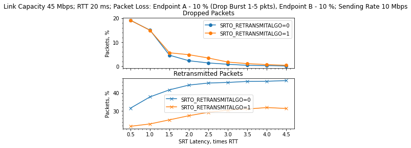

# Retransmission Algorithm Upgrade

## Introduction

Recently a new retransmission algorithm was developed for SRT ... [Maria]

## Algorithm

The algorithm consists on [Maria]

## Testing the New Algorithm

In order to properly test the new algorithm we conducted two different procedures:

* Lab set up: using a LanForge to simulate network conditions.
* Public Internet: using the scripts in [lib-srt-utils](https://github.com/mbakholdina/lib-srt-utils) to automate connections from a home office in Madrid to different regions over Wi-Fi.

The objective of these tests was to probe that the new algorithm produces less retransmissions and might increase the number of dropped packets by design.

### Lab Set Up Tests

**Note: Maybe we should re-run the notebook so we use re-sample instead of rolling **

#### Data Collection

The datasets were collected using the Big-Flip, Big-Flop, small LanForge (link capacity up to 45 Mbps) test setup. For all the use cases with no limits on link capacity, it was set to 45 Mbps.

It's important to note that data were collected under the following conditions:

* SRT v1.4.2
* Both for retransmit algo = 0 (the default one) and = 1 (the improved one).
* The value of MAXBW was not limited to any level as it's done in Hai products (usually 25%). The default value of 1 Gbps was used.
* The values of sender and receiver buffers were set to 1 Gbps.
* Experiment length was set to 2 minutes what's considered enough for not changing network impairments (not changing during experiment).
* The number of tries was equsl to 1 due to a lot of network parameters.
* srt-xtransmit application was used to generate the source stream at a particular rate (CBR).

The following metrics were calculated for each experiment:

* `loss_reports_ratio`: loss reports ratio, %, sender side.
* `lost_ratio`: lost packets ratio, %, receiver side.
* `retransm_ratio`: retransmitted packets ratio, %, sender side.
* `dropped_ratio`: dropped packets ration, %, receiver side.

All the metrics were calculated as a percentage of sent unique DATA packets (only original packets without retransmitted). It's an average ratio per experiment.

Additionally the following metrics were obtained:

* `dropped_ratio_1s_q95`: in 5 % of cases the drop ratio is higher than this value, averaged for 1 s interval
* `dropped_ratio_1s_q99`: in 1 % of cases the drop ratio is higher than this value, averaged for 1 s interval
* `dropped_ratio_1s_max`: maximum achieved during the experiment drop ratio, averaged for 1 s interval

To calculate these metrics, first a **[resample of 10 observations?]** rolling sum for 10 observations was applied, then Q95 / Q99 / Max was calculated. This was done to average the data for 1 s interval. The original observations were collected each 100 ms.

#### Data Analysis

##### Bidirectional Packet Loss, Enough Link Capacity
As a start,  data for the following network parameters was collected:

* Link Capacity = 45 Mbps; RTT = 20 ms;
* Bidirectional Packet Loss: 5 %, 10 %;
* Sending Rate: 5 Mbps, 10 Mbps.

Here are the summary plots showing the level of retransmitted packets ratio as well as dropped packets ratio for both retransmit algo: default (`SRTO_RETRANSMITALGO=0`) and improved one (`SRTO_RETRANSMITALGO=1`):

##### Burst Packet Loss, Enough Link Capacity

Let us now consider the influence of burst packet loss on the quality of SRT streaming. This time we will compare the results for the following scenarios:

1. Link Capacity = 45 Mbps; RTT = 20 ms; Packet Loss: Endpoint A - 10%, Endpoint B - 10%; Sending Rate = 10 Mbps.

2. Link Capacity = 45 Mbps; RTT = 20 ms; Packet Loss: Endpoint A - 10% (Drop Burst 1-2 packets), Endpoint B - 10%; Sending Rate = 10 Mbps.

3. Link Capacity = 45 Mbps; RTT = 20 ms; Packet Loss: Endpoint A - 10% (Drop Burst 1-2 packets), Endpoint B - 10% (Drop Burst 1-2 packets); Sending Rate = 10 Mbps.
4. Link Capacity = 45 Mbps; RTT = 20 ms; Packet Loss: Endpoint A - 10% (Drop Burst 1-5 packets), Endpoint B - 10%; Sending Rate = 10 Mbps.
5. Link Capacity = 45 Mbps; RTT = 20 ms; Packet Loss: Endpoint A - 10% (Drop Burst 1-5 packets), Endpoint B - 10% (Drop Burst 1-5 packets); Sending Rate = 10 Mbps.

The only difference is in the Drop Burst value which is an amount of packets to drop per drop event. By default, it is 1 packet. For the 2nd and 4th scenarios, we emulate Drop Burst up to 2 and 5 packets respectively on Endpoint A (sender side) only. For the 3rd and 5th scenarios, we emulate Drop Burst up to 2 and 5 packets respectively on both ends.

Here are the summary plots:

### Public Internet Tests

The purpose of these tests is to check how the new SRT retransmission algorithm works over public networks.
#### Set up

* Sender: Madrid. Wifi. Download: 18.40 Mbps. Upload 16.34 Mbps.

* Receiver: Azure VM.
    * East US
    * East Japan
    * Central Australia

Here is a table of the measured RTT for `100 seconds` before test with `ping` (100 samples, units in `ms`):

| cluster           | min     | avg     | max     | std   |
| ----------------- | ------- | ------- | ------- | ----- |
| east-us           | 80.499  | 84.298  | 128.826 | 6.649 |
| east-japan        | 216.703 | 218.390 | 231.571 | 2.121 |
| central-australia | 245.593 | 247.718 | 273.788 | 3.759 |

The configured SRT RTT was equal to the ceiling of the avg field: 

* east-us: 84.298 -> 85
* east-japan: 218.390 -> 219
* central-australia: 247.718 -> 248

The sending rate was set to `10Mbps` for all tests. The RTT multiplier ranged from 0.5 to 5 in steps of 0.5. 10 experiments were done for each configuration.

##### EAST-US

###### Retransmission Ratio

We can take a look at the values of retransmission ratios of each algorithm (the red cross represents the mean):

By means of linear regression, we can test if the mean value of `retransm_ratio` changes with the algorithm, the variable `latency_x_rtt` was removed from this regression since it was found to be non-significant. This is equivalent of doing a two sample t-test.

The test was found to be non significant (p-value of `0.311`), the difference in means of `retransm_ratio` when the algorithm is activated is: `-0.0003830%` with a 95% confidence interval: `(-0.001125%, 0.000359%)`.

Here we can see how the retransmitted packets change over `latency_x_rtt`:

###### Dropped Ratio

We can take a look at the values of dropped ratios of each algorithm (the red cross represents the mean):

[** What is up with a dropped ratio bigger than 100%? **]

By means of linear regression, we can test if the mean value of `dropped_ratio` changes with the algorithm, the variable `latency_x_rtt` was removed from this regression since it was found to be non-significant. This is equivalent of doing a two sample t-test.

The test was found to be non significant (p-value of `0.277`), the difference in means of `dropped_ratio` when the algorithm is activated is: `1.4028%` with a 95% confidence interval: `(-1.135%, 3.941%)`.

Here we can see how the dropped packets change over `latency_x_rtt`:

Here is a zoom in of the previous plot:

